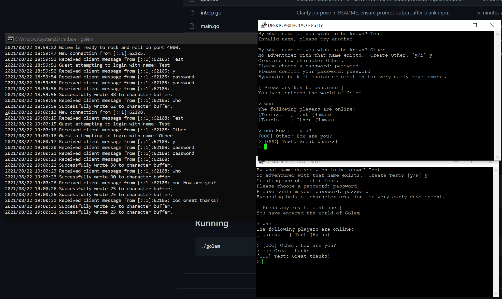

# Golem

## Overview

Golem is a from-scratch attempt at a Diku-like MUD implemented with Golang in 2021.  Entirely for tinker-fun.

## Installation

```
git clone git@github.com:jskz/golem.git
cd golem
go get
go build
```

## Running

```
./golem
```

