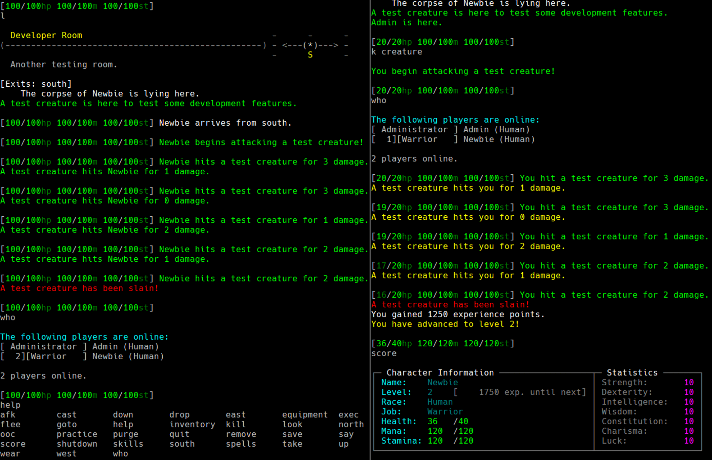

# Golem

## Overview

Golem is a from-scratch attempt at a Diku-like MUD implemented with [Go](https://golang.org/) in 2021.

The development objective is to create an approachably simple yet flexible and scriptable skeleton for a hack-and-slash MUD; a secondary goal is to provide this with a directory and module structure that is immediately *at home* familiar to enthusiasts who have tinkered with similar [DIKU](https://github.com/sneezymud/dikumud) [derivatives](https://github.com/alexmchale/merc-mud) [over](https://github.com/Yuffster/CircleMUD) [the](https://github.com/DikuMUDOmnibus/ROM) [years](https://github.com/smaugmuds/_smaug_).

## Requirements

Docker
## Retrieve, Build, Start

```
git clone git@github.com:jskz/golem.git
cd golem
docker build --tag golem:latest .
docker-compose up
```

The MUD is exposed on the host's TCP port 4000 by default.

A phpMyAdmin instance is exposed on port 8000 providing root access to the game's MySQL storage.

## Destroying all database data and starting over

```
docker-compose down
docker volume rm golem_db_data
```

## Screenshot


