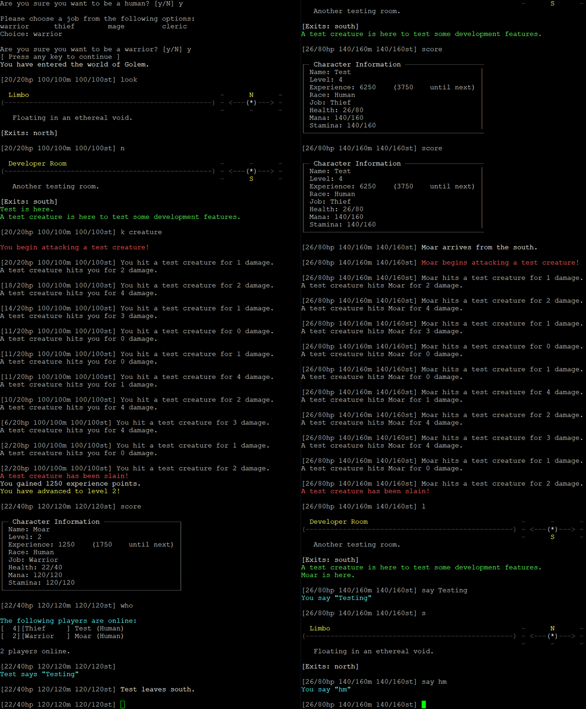

# Golem

## Overview

Golem is a from-scratch attempt at a Diku-like MUD implemented with Golang in 2021.  Entirely for tinker-fun.

## Requirements

Docker
## Retrieve, Build, Start

```
git clone git@github.com:jskz/golem.git
cd golem
docker build --tag golem:latest .
docker-compose up
```

The MUD is exposed on the host's TCP port 4000 by default.

